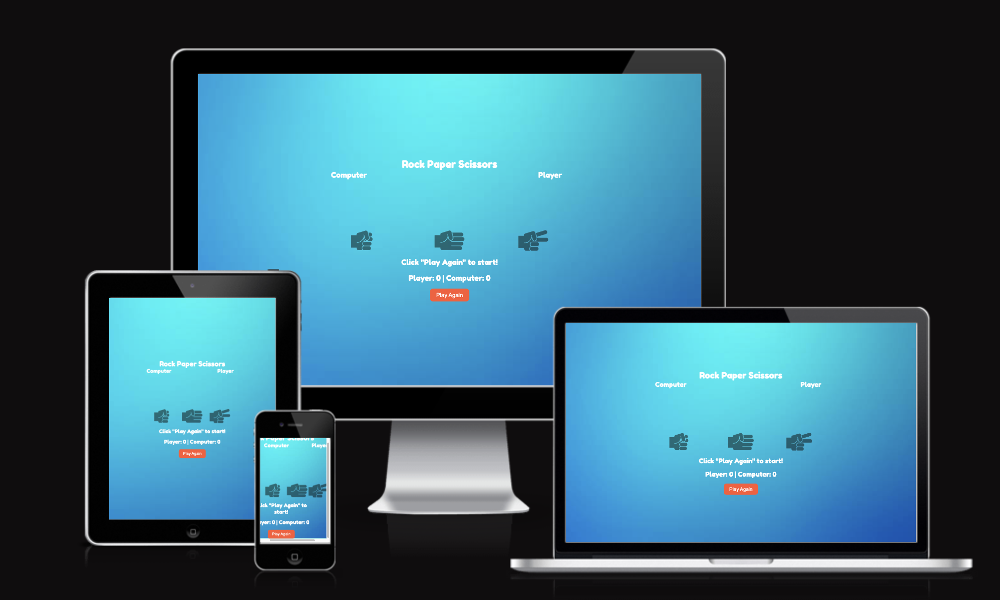
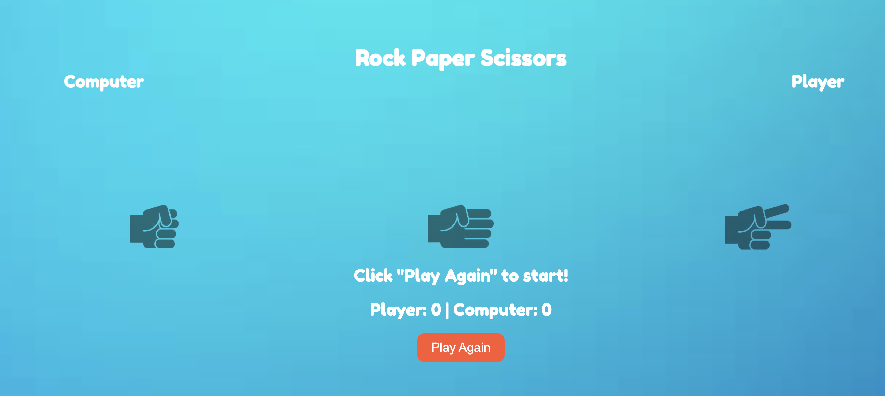
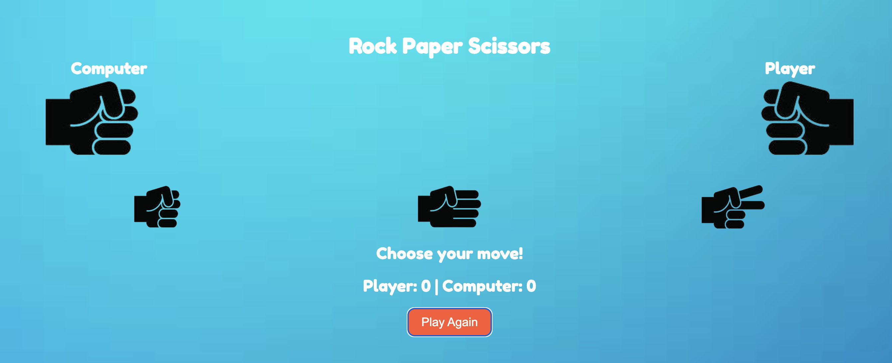
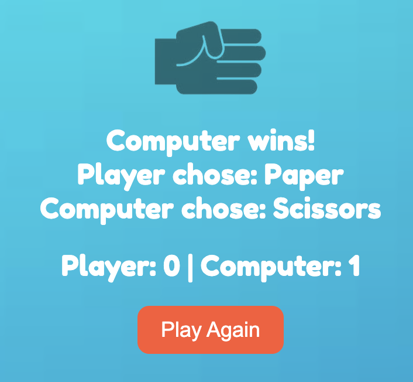

## Features

Rock Paper Scissors provides a simple enterteinment with all informations clearly displayed reflecting current winning party.
 
#### 1. Main Menu     
  * Provides clear informations about the game controls and how to use them. 
  * Clearly marked action button prompts to start the game.
  
 

#### 2. In Game 
  * Status bar displayed current score of Player and Computer.
  * Three different options are visible to the Player and headline prompts to action"
  

#### 3. Game Outcome 
  * Game outcome is clearly presented with explanation what choices were made by Player and Computer. 
  * Scoreboard is updated. 
  

#### 4. Game Outcome 
  * Excaitmenat is build by shaking hand effect before game outcome is presented. 

## Testing 
  Extensive testing was employed to ensure responsiveness of Space Sooter game at all the devices. During that process a number of minor bug was eliminated like:
   * On screen buttons no responding. 
  
### Validator Testing 
  1. HTML - minor errors returned, trailing slash on void elements warning, to be fixed shortly but due to project deadline ignored for now. [W3C validator](https://validator.w3.org/nu/?doc=https%3A%2F%2Fmr-pete.github.io%2FRock-Paper-Scissors%2F)
  2. CSS - no errors returned, all passed through [Jigsaw validator](https://jigsaw.w3.org/css-validator/validator?uri=https%3A%2F%2Fmr-pete.github.io%2FRock-Paper-Scissors&profile=css3svg&usermedium=all&warning=1&vextwarning=&lang=pl-PL)

## Deployment
  Rock Paper Scissors was deployed to GitHub pages by the standard steps including:
    * Navigation to settings in the GitHub repository and Pages section
    * Selection of Main Branch from drop-down source menu.
 The live link to the website - hhttps://mr-pete.github.io/Rock-Paper-Scissors/
 
 ## Credits
 
 ### Content
  * The game inspiration was taken from [Google I/O 2011](https://www.youtube.com/watch?v=yEocRtn_j9s)
  * The instruction on how to build a game were taken from [Shradha Khapra YouTube channel] (https://youtu.be/_V33HCZWLDQ?si=AjXOaCVSSfpwLHne) and [
    developedbyed channel] (https://www.youtube.com/watch?v=qWPtKtYEsN4)

 
 ### Media
  * * The icons were taken from [PngWing](https://www.pngwing.com)
